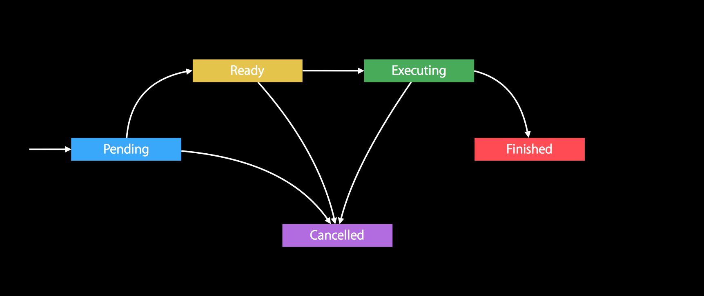

# 探究NSOperation
> 想要执行多线程操作，你有很多选择。比较流行和轻量级的是使用CGD。但是如果遇到一些有先后执行顺序的操作或者删除操作的时候，虽然使用GCD也能胜任，但是没有NSOperation来得简单。

### 介绍NSOperation
`NSOperation`是`dispatch_block_t`的高级封装(`NSOperationQueue`是`dispatch_queue_t`的高级封装),它用来封装希望应用程序执行的工作。 `NSOperation`本身是一个抽象基类，`不能直接使用`。所有执行任务都使用它的子类（`NSInvocationOperation`、`NSBlockOperation`）。尽管是抽象的，但它定义了许多有用的属性。

这里需要提一下`NSOperation`的各个状态:
`NSOperation`创建的时候处于`Pending`状态，准备好运行的条件之后，状态变为`Ready`,然后执行操作，此时的状态是`Executing`,执行完之后变为`Finished`。在`Pending`、`Ready`、`Executing`的过程中可能进行取消操作，这时的状态是`Cancelled`。而`Finished`不能变为`Cancelled`状态。整个过程的如下图：


<br>
下面就介绍它的两个子类：

* **NSInvocationOperation**
    `NSInvocationOperation`类是`NSOperation`的具体子类，它在运行时会调用指定的对象上指定的`Selector`。使用此类可以避免为应用程序中的每个任务定义大量自定义操作对象;特别是如果要修改现有的应用程序并且已经拥有执行必要任务所需的对象和方法。**这个类实现了非并发操作**。
它的创建很简单:
    
    ```objc
    NSInvocationOperation *operation1 = [[NSInvocationOperation alloc] initWithTarget:self selector:@selector(taskUseInvocationOperation1) object:nil]; 
    ```

* **NSBlockOperation**
`NSBlockOperation`类是`NSOperation`的具体子类，充当一个或多个`block`对象的包装。还可以使用块操作来利用操作依赖关系，`KVO`通知以及可能不适用于分派队列的其他功能。
在创建块操作时，通常在初始化时至少添加一个块;你可以稍后根据需要添加更多块。当需要执行`NSBlockOperation`对象时，`对象将其所有块提交给默认优先级并发调度队列`。该对象然后等待，直到所有块完成执行。当最后一个块完成执行时，操作对象将自己标记为已完成。因此，你可以使用块操作来跟踪一组正在执行的块，就像使用线程连接合并多个线程的结果一样。区别在于，因为块操作本身在单独的线程上运行，所以应用程序的其他线程可以在等待块操作完成的同时继续工作。**这个类实现了并发操作**。
它的创建很简单:

    ```objc
    NSBlockOperation *blockOperation = [NSBlockOperation blockOperationWithBlock:^{
        NSLog(@"blockOperation");
    }];
    ```
    你也可以继续往`NSBlockOperation`添加执行块：

    ```objc
    [blockOperation addExecutionBlock:^{
        NSLog(@"other block");
    }];
    ```
    
对于有依赖的`NSOperation`，可以添加依赖。

```objc
NSOperationQueue *queue = [[NSOperationQueue alloc] init];
queue.maxConcurrentOperationCount = 2;
NSInvocationOperation *operation1 = [[NSInvocationOperation alloc] initWithTarget:self selector:@selector(taskUseInvocationOperation1) object:nil];
NSBlockOperation *blockOperation = [NSBlockOperation blockOperationWithBlock:^{
    NSLog(@"Operation 2");
}];

[blockOperation addDependency:operation1];
    
[queue addOperation:blockOperation];
[queue addOperation:operation1];
    
- (void)taskUseInvocationOperation1 {
    sleep(2);
    NSLog(@"Operation 1");
}
```
执行的结果

```log
2018-05-24 11:51:10.998880+0800 NSOperation_Ex[16760:907856] Operation 1
2018-05-24 11:51:10.999673+0800 NSOperation_Ex[16760:907856] Operation 2
```
执行`NSOperation`有两种方式`自动`和`手动`执行。

* **自动方式**：是由`NSOperationQueue`来调用`NSOperation`的`start`方法。
* **手动方式**：是直接调用`NSOperation`的方法`start`。对于非并发的NSOperation，在当前线程执行。


### 自定义NSOperation

##### 1.自定义非并发的NSOperation
这个比较简单,你唯一需要做的就是`自定义初始化方法`和`main`方法。

```objc
#import "PlumSingleOperation.h"

@interface PlumSingleOperation ()
@property (nonatomic, copy) NSString *identifier;
@end

@implementation PlumSingleOperation

- (instancetype)initWithIdentifier:(NSString *)identifier {
    if (self = [super init]) {
        _identifier = identifier;
    }
    return self;
}

- (void)main {
    if (!self.isCancelled) {
        NSLog(@"my identifier is : %@", _identifier);
    } else {
        NSLog(@"operation be cancelled");
    }
}

@end
```
##### 2. 自定义并发的NSOperation
自定义并发的`NSOperation`需要实现以下几个方法：

* **start（Required）：** 所有并发操作都必须重写此方法，并用它们自己的自定义实现替换默认行为。要手动执行操作，请调用其`start`方法。因此，此方法的实现是操作的起点，并且是设置执行任务的线程或其他执行环境的位置。实现不能在任何时候调用`super`。
* **main（optional）：** 此方法通常用于实现与操作对象关联的任务。虽然可以在`start`方法中执行任务，但使用此方法执行任务可以使设置和任务代码更清晰地分离。
* **isExecuting（Required）：** 并发操作负责设置其执行环境并向外部客户报告该环境的状态。因此，并发操作必须保存一些状态信息，以了解它何时执行任务以及何时完成该任务。它必须使用这些方法报告该状态。这些方法的实现必须是安全的，以便同时从其他线程调用。更改这些方法报告的值时，还必须为预期的键路径生成适当的KVO通知。
* **isFinished（Required）：**同上
* **isConcurrent（Required）：**要将操作标识为并发操作，请覆盖此方法并返回`YES`。

以下就是自定义的并行`NSOperation`的实现：

```objc
#import "PlumConcurrentOperation.h"

@interface PlumConcurrentOperation ()

@property (nonatomic, assign) BOOL myExecuting;
@property (nonatomic, assign) BOOL myFinished;

@end

@implementation PlumConcurrentOperation

- (instancetype)init {
    if (self = [super init]) {
        _myExecuting = NO;
        _myFinished = NO;

    }
    return self;
}

- (BOOL)isFinished {
    return _myFinished;
}

- (BOOL)isExecuting {
    return _myExecuting;
}

- (BOOL)isConcurrent {
    return YES;
}

- (void)main {
    if (!self.cancelled) {
        [self handleComplete];
         NSLog(@"I am Concurrent Operation");
    }
}

- (void)start {
    if (self.isCancelled) {
        [self willChangeValueForKey:@"isFinished"];
        _myFinished = YES;
        [self didChangeValueForKey:@"isFinished"];
        return;
    }
    [self willChangeValueForKey:@"isExecuting"];
    [NSThread detachNewThreadSelector:@selector(main) toTarget:self withObject:nil];
    _myExecuting = YES;
    [self didChangeValueForKey:@"isExecuting"];
}


// custom
- (void)handleComplete {
    [self willChangeValueForKey:@"isExecuting"];
    [self willChangeValueForKey:@"isFinished"];
    
    _myExecuting = NO;
    _myFinished = YES;
    
    [self didChangeValueForKey:@"isFinished"];
    [self didChangeValueForKey:@"isExecuting"];
}


@end
```
<div class="tip">
注意：对于并行的`NSOperation`，在实现`main`和`start`方法的时候，需要判断`isCancelled`的状态，如果`isCancelled`等于`YES`,需要把`isFinished`设置成`YES`。如果手动启动有依赖的`NSOperation`，那么还需要根据依赖的`NSOperation`的`isFinish`属性来设置`isReady`的状态。
</div>

### 参考资料
* [Concurrency Programming Guide](https://developer.apple.com/library/content/documentation/General/Conceptual/ConcurrencyProgrammingGuide/OperationObjects/OperationObjects.html#//apple_ref/doc/uid/TP40008091-CH101-SW1)
* [Advanced NSOperations](https://developer.apple.com/videos/play/wwdc2015/226/)

