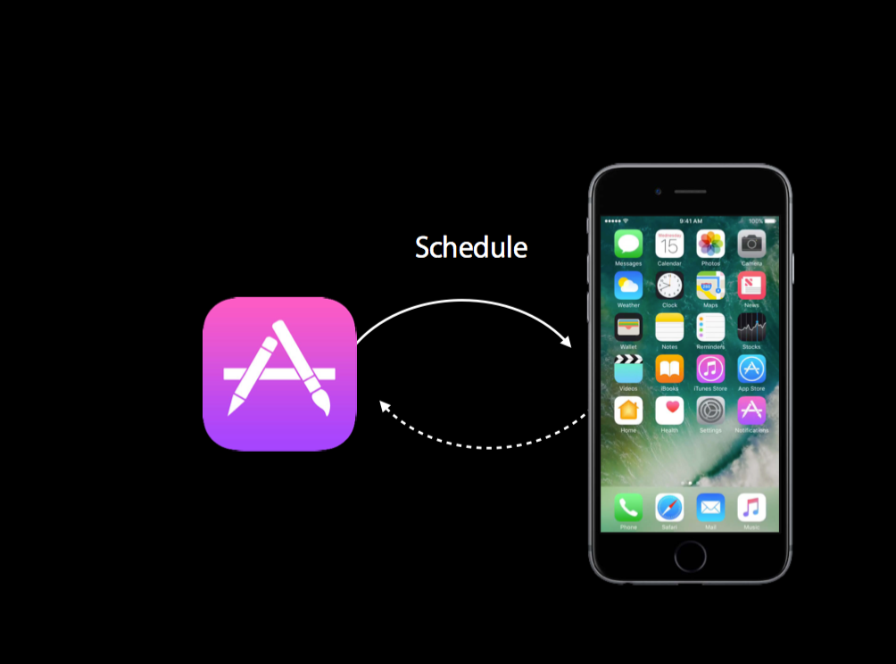
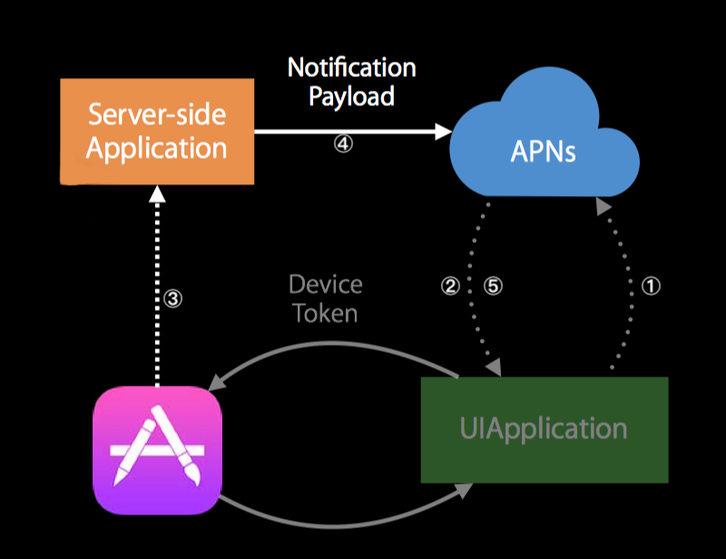
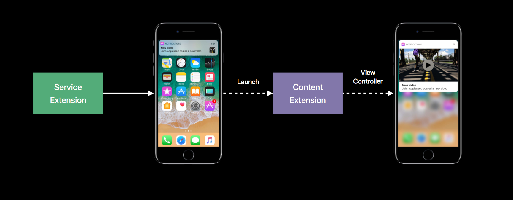
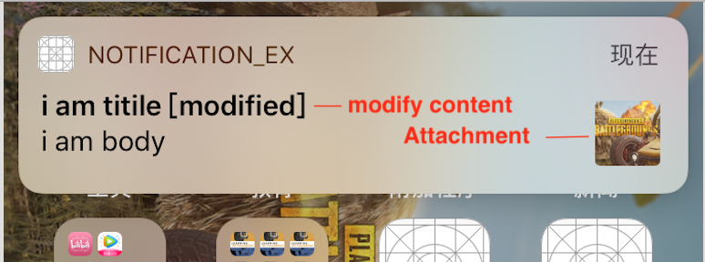
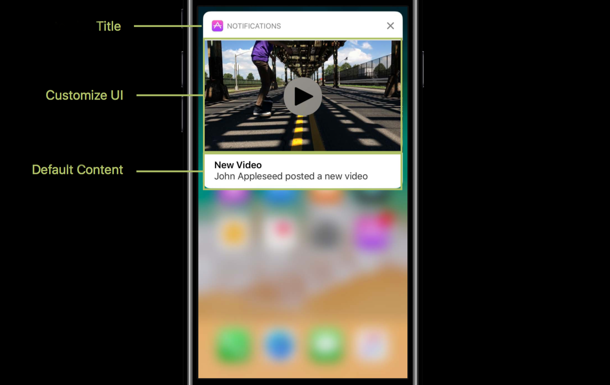

# 探究iOS推送

> 消息推送在iOS上有很重要的用途，你可以在联网或者没有联网的环境下通知你的用户，然后进行一些操作，尽管你的App可能不在前台运行或者根本就没有启动。消息推送让用户不错过任何一条有用的消息成为可能。苹果官方重新整合了推送功能，使之成为一个Framework，让消息推送变得更加强大，更加丰富多彩。
> 博客最后一节是自己在探究过程当中遇到的一些问题，说不定你也有这样的问题，并且还没有找打解决方法。

### 消息推送原理解析
> 要让APP使用推送功能，建议打开`Capabilities —> Push Notifications`

消息推送分为`本地消息推送`和`远程消息推送`，两种类型的原理和流程不同。下面分别详细说说两种推送类型的原理。
#### 1. 本地推送
原理图如下：

本地推送就是`APP`设置好推送消息的触发类型和消息内容然后派发到系统，系统根据触发类型来判断是否应该推送消息。触发类型有`间隔时间触发（IntervalNotificationTrigger）`、`日历触发（CalendarNotificationTrigger）`、`地理位置触发（LocationNotificationTrigger）`。触发的条件正如名字所描述那样。

<div class="tip">
UNNotificationTrigger的另一个子类UNPushNotificationTrigger，是远程消息推送触发器，不直接使用。
</div>

#### 2. 远程推送
流程图如下：

**①** 应用通过方法`registerForRemoteNotifications`，向APNS(Apple Push Notification service)注册远程推送通知。
**②** 注册远程推送成功或者失败可以通过AppDelegate的方法告知。注册失败AppDelegate的方法

```swift
func application(_ application: UIApplication, didFailToRegisterForRemoteNotificationsWithError error: Error)
```
会被调用。如果注册成功，那么方法

```swift
func application(_ application: UIApplication, didRegisterForRemoteNotificationsWithDeviceToken deviceToken: Data)
```
会被调用，参数中的`deviceToken`是唯一的值，决定那个设备接受推送通知，这个值并不是一成不变的，当`App重新安装`、`重新安装系统`、`从备份恢复系统`等。
**③** App把`deviceToken`传递给自己的服务器（Provider），作为服务器传递给APNS中的一个参数。
**④** 服务器（Provider）把`deviceToken`作为其中一个参数，并把需要推送的消息内容按照苹果的要求的格式一起发送给APNS。
**⑤** APNS根据`deviceToken`把消息推送给相应的设备。

### 实战训练
> 实战训练的目的是使用`UNUserNotification`库来进行消息推送

准备工作：**开发环境的推送证书**、**消息推送工具**--[SmartPush](https://github.com/shaojiankui/SmartPush)

#### 1. 基础知识

苹果的提醒方式有三种`alert`、`sound`、`badge`。所以在App启动的时候就要设置提醒方式,方法如下

``` swift
func requestAuthorization(options: UNAuthorizationOptions = [], completionHandler: @escaping (Bool, Error?) -> Swift.Void)
```
如果没有设置，你的APP就不会有sound提醒。我就在这里犯过错，并且困扰了几个小时。^ - ^

如果需要接受远程推送，那么还需要调用方法

``` swift
UIApplication.shared.registerForRemoteNotifications()
```
如果注册成功了，那么在获取token的方法里面把token打印出来，然后填入SmartPush中进行远程推送测试。如果使用swift那么方法需要这样写：

``` swift
 func application(_ application: UIApplication, didRegisterForRemoteNotificationsWithDeviceToken deviceToken: Data) {
    let token = deviceToken.map{String(format: "%02.2hhx", $0)}.joined()
    print(token)
 }
```
除此之外还有一点你需要知道，新的管理推送的库有个类`UNUserNotificationCenterDelegate`，这负责监听推送，原来的AppDelegate方法

```objc
- (void)application:(UIApplication *)application didReceiveRemoteNotification:(NSDictionary *)userInfo
```
已经在iOS10被遗弃了。这个协议有两个方法

``` swift
/* 这个是在APP在前台时，接受到推送消息触发，这里可以设置推送提醒的方式，把需要的提醒方式传入completionHandler*/
 optional public func userNotificationCenter(_ center: UNUserNotificationCenter, willPresent notification: UNNotification, withCompletionHandler completionHandler: @escaping (UNNotificationPresentationOptions) -> Swift.Void)
 /* 这里APP在后台或者APP没有运行，通过推送消息进入APP的时候触发*/
 optional public func userNotificationCenter(_ center: UNUserNotificationCenter, didReceive response: UNNotificationResponse, withCompletionHandler completionHandler: @escaping () -> Swift.Void)
```
#### 2. 本地推送
本地推送推送需要的类如下：

* 推送内容类`UNNotificationContent`。创建本地推送的内容使用的是它的子类`UNMutableNotificationContent`，
* 触发类`UNNotificationTrigger`，由于`UNNotificationTrigger`是一个基类，所以不直接使用它，而是使用它的三个子类`UNTimeIntervalNotificationTrigger`、`UNCalendarNotificationTrigger`、`UNLocationNotificationTrigger`。
* 把`UNNotificationContent`和`UNNotificationTrigger`生成请求类`UNNotificationRequest`

创建本地推送的整个代码如下：

```swift
func createLocalNotification() {
    let content = UNMutableNotificationContent()
    content.body = "hello" //内容
    content.title = "plum" //标题
    content.categoryIdentifier = "PLUM" //category标识符 
    content.launchImageName = "Screenshot01@2x" //打开APP的启动图
    content.sound = UNNotificationSound.default() //声音
    
    //间隔触发
    let trigger = UNTimeIntervalNotificationTrigger(timeInterval: 4, repeats: false)
    let request = UNNotificationRequest(identifier: "PLUM", content: content, trigger: trigger)
    
    let center = UNUserNotificationCenter.current()
    center.add(request) { (error) in
        if let er = error {
            print(er)
        }
    }
}
```

#### 3. 远程推送
远程推送在基础知识中已经介绍，下面是代码

```swift
func application(_ application: UIApplication, didFinishLaunchingWithOptions launchOptions: [UIApplicationLaunchOptionsKey: Any]?) -> Bool {  
    let userNotificationCenter = UNUserNotificationCenter.current()
    userNotificationCenter.delegate = self
    //获取推送的提示样式权限
    userNotificationCenter.requestAuthorization(options: [.badge, .alert, .sound]) { (grant, error) in
        if (grant) {
            print("requestAuthorization success")
        }
    }
    UIApplication.shared.registerForRemoteNotifications()
    return true
}

//注册成功返回token
func application(_ application: UIApplication, didRegisterForRemoteNotificationsWithDeviceToken deviceToken: Data) {
    let token = deviceToken.map{String(format: "%02.2hhx", $0)}.joined()
    debugPrint(token)
}

func application(_ application: UIApplication, didFailToRegisterForRemoteNotificationsWithError error: Error) {
    print(error)
}
```

#### 4. Category and Action 

`Category`定义APP支持的通知类型，并向系统传达你希望如何呈现通知的方式。您可以使用`Category`将自定义Action与通知相关联，并指定如何处理该类型通知的选项。
一个Category你可以定义最多`4`个Action。
Action的定义如下：

```swift
public convenience init(identifier: String, title: String, options: UNNotificationActionOptions = [])
```
UNNotificationActionOptions有三个值

* **authenticationRequired:** 要求设备处于解锁状态
* **destructive:** 表示它执行破坏性任务。对于删除用户数据或更改应用程序的操作，使用此选项是不可撤销的。
* **foreground:** 需要启动APP

如果一些聊天类型的APP,可能希望不用打开APP就能就行回复，那么你需要用到`UNTextInputNotificationAction` 。

`Category`有两个定义的方法：

```swift
/*identifier：用来区分不同的Category
intentIdentifiers：使用Siri的一些请求能用到*/
public convenience init(identifier: String, actions: [UNNotificationAction], intentIdentifiers: [String], options: UNNotificationCategoryOptions = [])

@available(iOS 11.0, *)
public convenience init(identifier: String, actions: [UNNotificationAction], intentIdentifiers: [String], hiddenPreviewsBodyPlaceholder: String, options: UNNotificationCategoryOptions = [])
```
第二个方法的参数hiddenPreviewsBodyPlaceholder是用来显示隐藏通知内容的占位符。在手机设置--通知--显示预览，可以看到有三个值，默认选择始终，当选择‘解锁时’，手机处于锁屏状态看推送通知就不会显示内容而是显示一个简短的概要。可以结合Localization来自定义想要的概要描述。这样设置你才能体现`thread_id`的作用，后面**Troubleshoot**会再次说明。要想通知对应于Category,对于本地推送，`UNMutableNotificationContent`的属性`categoryIdentifier`，对于远程推送，`aps`里面加入`category`字段，值为Category的`identifier`。

#### 5. Extension
`Extension`分为**Notification Service Extension** 和 **Notification Content Extension**，他们和APP的关系如下图所示：
。 

**① Notification Service Extension**

Service Extension适用于`远程推送`，使用的是UNNotificationServiceExtension的子类。使用

```swift
func didReceive(_ request: UNNotificationRequest, withContentHandler contentHandler: @escaping (UNNotificationContent) -> Swift.Void)
```
方法创建并配置一个新的UNMutableNotificationContent对象。它的作用有如下

* 解密以加密格式传送的数据。
* 下载图像或其他媒体文件并将它们作为附件添加到通知中。
* 更改通知的正文或标题文本。
* 向通知中添加线程标识符或修改通知的userInfo字典的内容。

总的来说， Service Extension 使得推送通知在展示之前，有一次机会进行数据的操作或者添加Attachement,但是需要注意在这里不能占用太多时间，当允许的最大时间截止，会调用方法：

```swift
func serviceExtensionTimeWillExpire()
```
并且显示原始的内容。要想Service Extension起作用，你需要在远程推送字典里面添加`"mutable-content": 1`,以下是发往APNS的数据JSON格式

```JSON
{
  "aps": {
    "alert": {
      "title": "i am title",
      "body": "i am body"
    },
    "badge": 9,
    "sound": "default",
    "mutable-content": 1
  }
}
```

完整的代码如下：

```swift
class NotificationService: UNNotificationServiceExtension {

    var contentHandler: ((UNNotificationContent) -> Void)?
    var bestAttemptContent: UNMutableNotificationContent?

    override func didReceive(_ request: UNNotificationRequest, withContentHandler contentHandler: @escaping (UNNotificationContent) -> Void) {
        self.contentHandler = contentHandler
        bestAttemptContent = (request.content.mutableCopy() as? UNMutableNotificationContent)
        if let bestAttemptContent = bestAttemptContent {
            // Modify the notification content here...
            bestAttemptContent.title = "\(bestAttemptContent.title) [modified]"
           
            let url = Bundle.main.url(forResource: "attach_image", withExtension: "png")!
            
            do {
                let attachment = try UNNotificationAttachment(identifier: "picture", url: url, options: nil)
                bestAttemptContent.attachments = [attachment]
            } catch let error as NSError {
                print(error)
            }
            contentHandler(bestAttemptContent)
        }
    }
    
    override func serviceExtensionTimeWillExpire() {
        //使用原始信息
        if let contentHandler = contentHandler, let bestAttemptContent =  bestAttemptContent {
            contentHandler(bestAttemptContent)
        }
    }

}
```

效果图：


<br>
**② Content Extension**
> 要看到Content Extension的界面，你可以在收到banner时下拉，或者按住banner,就会显示界面


使用通知Content Extension为推送通知显示自定义用户界面。例如，你可以使用这种类型的扩展程序来显示图像或媒体文件。Content Extension遵守UNNotificationContentExtension协议，这个协议定义了一些方法用于一些媒体文件的播放和暂停操作。

Content Extension的界面如下：


如果对于不同的推送需要不同的UI,那么就需要创建多个Content Extension,并且在Extension的info.plist里面添加对应的CategoryIdentifier。

```swift
/*接受到和info.plist里面的UNNotificationExtensionCategory相同的CategoryIdentifier推送就会触发*/
public func didReceive(_ notification: UNNotification)

/*在content extension界面，点击Action的时候触发*/
optional public func didReceive(_ response: UNNotificationResponse, completionHandler completion: @escaping (UNNotificationContentExtensionResponseOption) -> Swift.Void)
```
<div class="tip">
需要注意的是，在Content Extension中不能触发按钮自定义的事件，当点击界面的时候会进入APP，除非把按钮放在自定义的inputView当中，这个后面会涉及到。
</div>

-------

如果需要进行媒体文件的操作，比如视频的播放和停止，那么就需要实现UNNotificationContentExtension的以下方法：

```swift
//设置播放按钮的样式，播放按钮是系统自带的
optional public var mediaPlayPauseButtonType: UNNotificationContentExtensionMediaPlayPauseButtonType { get }

//设置按钮尺寸
optional public var mediaPlayPauseButtonFrame: CGRect { get }

//颜色
@NSCopying optional public var mediaPlayPauseButtonTintColor: UIColor { get }

//播放操作
optional public func mediaPlay()

//暂停操作
optional public func mediaPause()
```
实现这里方法，你会看到界面上会有一个播放按钮。

-------

如果是一些聊天或者评论类型APP（例如iMessage），你可以在Content Extension进行回复而不必打开APP。但是这时的Category的Action采用的是`UNTextInputNotificationAction`，点击这样类型的Action会弹出带有keyboard的InputView,并且方法`func didReceive(_ response:, completionHandler completion: ) -> Swift.Void`的response是`UNTextInputNotificationResponse`类型。
当然也可以自定义一个`InputView`，要达到这样的目的，你需要重写`UIResponder`的方法：

```swift

// 自定义的视图
lazy var customView: UIView = {
    let view = UIView(frame: CGRect(x: 0, y: 0, width: 375, height: 150))
    view.backgroundColor = .red
    
    let button = UIButton(type: UIButtonType.custom)
    button.frame = CGRect(x: 50, y: 50, width: 50, height: 50)
    button.backgroundColor = UIColor.blue
    button.addTarget(self, action: #selector(click), for: .touchUpInside)
    view.addSubview(button)
    return view
}()

@objc func click() {
    self.label?.text = "hi content extension"
    self.resignFirstResponder()
}
    
//-----------------以下是UIResponder的方法---------------------
override var canBecomeFirstResponder: Bool {
    return true
}
    
override var inputView: UIView? {
    return self.customView
}
```
 在Content Extension的`info.plist`,可以有一些Key,这些Key的作用如下：
 
* **UNNotificationExtensionCategory:** 对应的CategoryIdentifier,可以是一个Dictionary或者Array。
* **UNNotificationExtensionInitialContentSizeRatio:** 自定义内容的宽高比。
* **UNNotificationExtensionDefaultContentHidden:** 控制默认内容的显示。
* **UNNotificationExtensionOverridesDefaultTitle:** 自定义顶部title。


#### 6. 远程推送key
这里介绍以下远程推送的Key

1. APS Dictionary Keys

| Key | 值类型 | 注释 |
| --- | --- | --- |
| alert | Dictionary or String | 标题、子标题、内容 |
| badge | Number | 角标 |
| sound | String | 声音 |
| content-available | Number | 配置 Background Update Notification |
| category | String | Category标识符 |
| thread-id | String | 通知标识，用于合并通知 |
| mutable-content | Number | 用于service extension进行修改操作|


2. Alert Keys

| Key | 值类型 | 注释 |
| --- | --- | --- |
| title | String | 标题 |
| body | String | 内容 |
| title-loc-key | String or null | 本地化标题key |
| title-loc-args | Array of strings or null | 作为本地化标题的参数 |
| action-loc-key | String or null | 本地化action的标题的key |
| loc-key | String | 本地化内容key |
| loc-args | Array of strings | 本地化内容参数 |
| launch-image | String | 通过通知启动app时候后的启动图(发现不起作用) |


### Troubleshoot
在学习UserNotifications的过程中，遇到一些问题，有些问题困扰的时间比较久，这里记录一下。也希望能够对于学习UserNotifications的其他人有些帮助。

1. 调试 Service Extension。
如果想在 Service Extension 打断点进行调试，你会发现不起作用。然后你把target换成  Service Extension的名字运行程序，发现也不能触发断点，正确的方式是：Debug -- Attach to Progress by PID or Name -- 输入 Service Extension的名称。
<div class=tip>
其他的Extension调试方式，把target换成Extension的名字运行程序，能触发断点，唯独Service Extension除外！
</div>

2. 推送内容本地化
刚开始发现loc-key和loc-args不起作用，多番查找之后才发现本地文件Localizable.strings没有关联到工程，所以导致无效。

3. `thread_id`没有作用
要想`thread_id`有作用，需要进行一些设置，在`手机设置--通知--显示预览`，当选择`解锁时`。试试吧。


### 参考资料
* [WWDC Advanced Notifications](https://developer.apple.com/videos/play/wwdc2016/708/)
* [WWDC Introduction to Notifications](https://developer.apple.com/videos/play/wwdc2016/707/)
* [Local and Remote Notification Programming Guide](https://developer.apple.com/library/content/documentation/NetworkingInternet/Conceptual/RemoteNotificationsPG/index.html#//apple_ref/doc/uid/TP40008194-CH3-SW1)
* [WWDC Best Practices and What’s New in User Notifications](https://developer.apple.com/videos/play/wwdc2017/708/)


