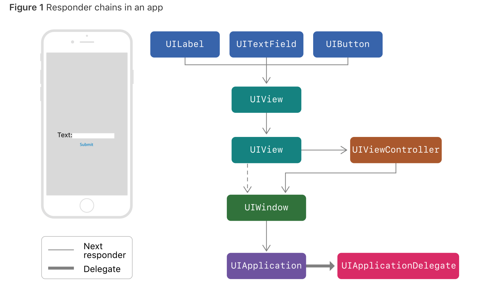

# 探索iOS事件处理
> 当我们点击`button`的时候，然后触发动作，这个过程表面上看似简单，但背后的流程是否真的弄明白了？是否我们可以用这些知识做一些什么功能呢？


### 原理分析
首先，分为四个过程来分析:

* **事件产生**
* **事件分发**
* **事件目标确定**
* **事件传递**

#### 事件产生
当用户生成的事件发生时，`UIKit`会创建一个事件对象，其中包含处理事件所需的信息。然后它将事件对象放入活动应用程序的事件队列中。对于触摸事件，该对象是一组打包在`UIEvent`对象中的触摸。对于运动事件，事件对象根据您使用的框架和您感兴趣的运动事件类型而异。事件的类型有 `TouchEvent`、`MotionEvent`、`RemotionEvent`。

#### 事件分发
`UIApplication`把事件充事件队列中拿出来，通过方法`sendEvent: `分发给`UIWindow`，然后`UIWindow`在调用方法`sendEvent:`发送给里面的控件。我们可以重写`sendEvent:`方法，来做一些事情，但是务必调用`[super sendEvent：theEvent]`。

#### 事件目标确定
怎样才能知道到底谁来处理这个事件呢？也就怎样寻找`FirstResponder`？`UIView`有个分类，里面有两个方法：

```objc
- (UIView *)hitTest:(CGPoint)point withEvent:(UIEvent *)event;
- (BOOL)pointInside:(CGPoint)point withEvent:(UIEvent *)event;
```
父视图通过向子视图发送`pointInside: withEvent: `来判断是否触摸的点在子视图的bounds里面。然后通过消息`hitTest: withEvent:` 返回的`View`来处理这个事件。
#### 事件传递
但是如果`firstResponder`不处理事件，那么事件就会通过响应链（`response chain`）传递下去。应用程序使用响应者对象接收和处理事件。响应者对象是`UIResponder`类的任何实例，子类包括`UIView`，`UIViewController`和`UIApplication`。响应链的传递如下图。

传递的规则如下：

*  `UIView`对象。如果视图是视图控制器的根视图，则下一个响应者是视图控制器;否则，下一个响应者是视图的父视图。
* `UIViewController`对象。<br>
   *  如果视图控制器的视图是窗口的根视图，则下一个响应者是窗口对象。
   * 如果视图控制器由另一个视图控制器呈现，则下一个响应者是   
   呈现视图控制器。
* `UIWindow`对象。窗口的下一个响应者是UIApplication对象。
* `UIApplication`对象。下一个响应者是应用程序委托，但前提是应用程序委托是UIResponder的实例，并且不是视图，视图控制器或应用程序对象本身。

如果想改变响应链路径，可以重写`nextResponder`;

### 功能应用
通过原理分析，我们可以得出一个结论和两个功能应用。

**1. UIButton不能响应事件的情况** 

 * `hidden = YES`
 * `alpha < 0.01`
 * `点击区域超出父视图`
 
**2. 扩大UIButton的响应区域**
    需要重写 `pointInside: withEvent:`,然后判断点位是否在响应的区域内。代码如下：
    
```objc
- (BOOL)pointInside:(CGPoint)point withEvent:(UIEvent *)event {
    //点击区域各个方向增加 50，这里需要看UIEdgeInsetsMake的实现
    CGRect rect = UIEdgeInsetsInsetRect(self.bounds, UIEdgeInsetsMake(-50, -50, -50, -50));
    return CGRectContainsPoint(rect, point);
}
```

**3. 做一个滑动展示图**
效果图如下:

实现这个最简单的就是使用一个`UIScrollView`,然后设置属性`clipToBounds = NO`,`pagingEnabled = YES`。再把`内容视图`和`UIScrollView`按照要求：
`内容宽 + padding  = scrollview宽度`；
需要注意的是`第一个视图`和`最后一个视图`相距scrollView的content距离为 `padding/2`,这样才能有居中效果。

[实验Demo](https://github.com/plumhly/HitTest_Ex)
<br>
### 参考资料：
* [Understanding Event Handling, Responders, and the Responder Chain](https://developer.apple.com/documentation/uikit/touches_presses_and_gestures/understanding_event_handling_responders_and_the_responder_chain?language=objc)
* [UIScrollView 实践经验](http://tech.glowing.com/cn/practice-in-uiscrollview/)

